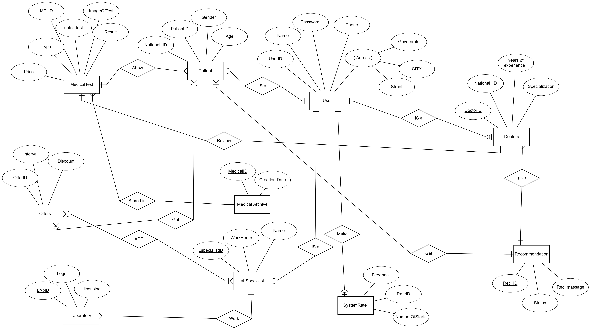

# Welcome to MediConnect Health System

MediConnect is a comprehensive health management system designed to streamline healthcare processes and enhance patient care. This integrated platform connects patients, doctors, lab specialists, and other healthcare providers to ensure a seamless and efficient healthcare experience.

## Database and SQL Overview

MediConnect utilizes a relational database to store and manage healthcare-related data. The database design follows an Entity-Relationship model to represent the relationships between different entities within the system.

[](https://opensource.org/licenses/MIT)
## Entity Relationship Diagram (ERD)
The ERD provides a visual representation of the relationships between entities such as Patients, Doctors, Lab Specialists, and more.




## Key Features

### 1. Patient-Centric Approach

- Patients have personalized profiles with essential information, medical history, and access to various healthcare services.

### 2. Doctor and Lab Specialist Collaboration

- Facilitates collaboration and communication between doctors, lab specialists, and other healthcare professionals to ensure coordinated and effective care.

### 3. Recommendation and Rating System

- Enables patients to receive recommendations from doctors, provide feedback through a rating system, and track their healthcare journey.

### 4. Appointment Scheduling and Offers

- Patients can schedule appointments with doctors and lab specialists. The system also provides information on special offers and discounts on healthcare services.

### 5. Medical Testing and Archive

- Manages medical tests, results, and archives patient health records securely, ensuring easy access for both patients and healthcare providers.

### 6. Systemic Rating and Feedback

- Includes a feedback system where users can rate healthcare providers and provide comments, contributing to the continuous improvement of healthcare services.

### 7. Healthcare Offers and Promotions

- Offers a platform for healthcare providers to promote special offers and discounts to attract patients.

### 8. Lab Specialist Integration

- Connects patients with lab specialists, providing information on work hours, services offered, and facilitating the scheduling of lab tests.

### 9. Secure User Authentication

- Implements a secure user authentication system to protect sensitive health information and ensure data privacy.


### Prerequisites

- MS SQL SERVER MANAGMENT 


### Installation

1. Clone the repository:

   ```bash
   git clone https://github.com/Hadikhaled/MediConnect-Health-System.git
   cd MedTestFeatureExtraction
   pip install -r requirements.txt


 ### Contributing
We welcome contributions from the community! To contribute:

1. Fork the repository.
2. Create a new branch: git checkout -b feature-name
3. Make your changes and commit: git commit -am 'Add some feature'
4. Push to the branch: git push origin feature-name
5. Submit a pull request.

## License
MediConnect aims to create a connected and patient-centric healthcare ecosystem, enhancing accessibility, communication, and overall efficiency in healthcare delivery.

This project is licensed under the MIT License. You can find a copy of the license in the [LICENSE](LICENSE) file.

© 2023, ITI 

### Contact
Hadi Khaled Abdelrhman - hadikhaled705@gmail.com

Project Link: [https://github.com/Hadikhaled/MedTestFeatureExtraction](https://github.com/Hadikhaled/MediConnect-Health-System)


MediConnect aims to create a connected and patient-centric healthcare ecosystem, enhancing accessibility, communication, and overall efficiency in healthcare delivery.
